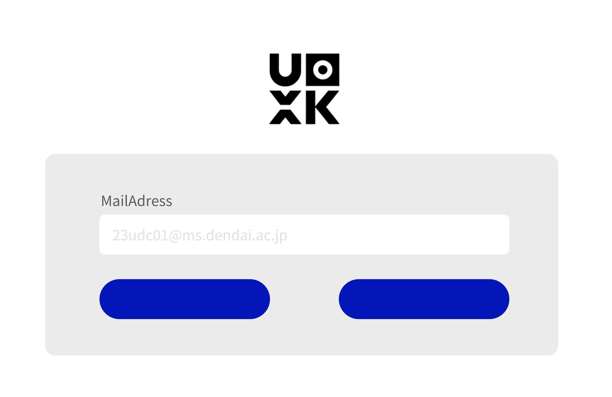
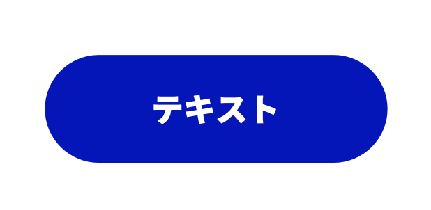
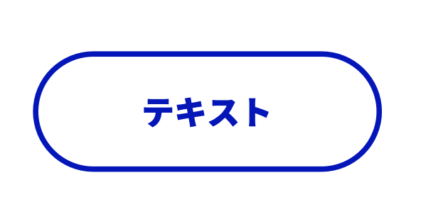
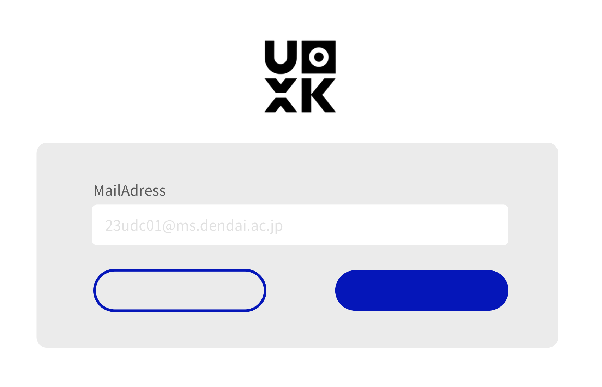

# 人間中心設計に基づいたWebアプリのボタンデザイン

## 目的
### 使いやすい Web アプリの画面を設計するため、ボタンデザインを使い分けられるようになる。

## 到達目標
1. **自分（設計者）の考えを、相手（ユーザ）に伝えることの難しさを知る**
2. **プライマリーボタンとセカンダリーボタンを理解する**
3. **それぞれの使い分けができる**

## 自分の考えをユーザに伝える難しさ

### シナリオ設定：
- Web アプリのログイン画面をデザイン
- 「次へ」と「クリア」ボタンを配置

## どちらが **「次へ」** のボタンですか？

## プライマリーとセカンダリー

### プライマリーボタン
- 説明：画面内の最重要アクションに使用
- 原則：1画面内に1つまで

### セカンダリーボタン
- 説明：プライマリー以外の選択肢に使用
- 原則：画面内で0〜3つまで

## どちらが **「次へ」** のボタンですか？

