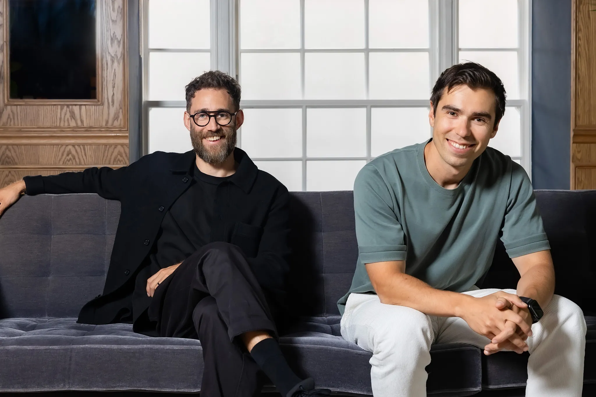

# Raycast創業秘話

## 概要

Raycastは、2017年にFacebookで出会った2人のエンジニア、Thomas Paul MannとPeter Rumcovskisが2020年に創業したMac向け生産性ツールです。

**毎朝のスカッシュ**で感じたスポーツバッグの持ち歩き問題から始まったランドリーサービスのアイデアが、Y CombinatorのAaron Sureл氏による**「なぜFacebookエンジニアがランドリーをやるのか？」**という率直な質問をきっかけに、わずか1ヶ月でバックアップアイデア「Stash」をRaycastプロトタイプに発展させ、現在では**総額5,000万ドル超を調達**した数千万ドル規模のスタートアップへと成長した創業ストーリーをご紹介します。

## 創業者プロフィール

### Thomas Paul Mann（CEO・共同創設者）
**学歴・経歴**
- 電気・電子工学学士（2008-2012年、TH Aschaffenburg応用科学大学）
- コンピューターサイエンス修士（2012-2015年、Fachhochschule Gelsenkirchen）
- Apple Store スペシャリスト（2012年）
- Facebook 拡張現実部門 ソフトウェアエンジニア（2017-2020年）

### Peter Rumcovskis（CTO・共同創設者）
**学歴・経歴**
- サンクトペテルブルク国立電気工学大学「LETI」コンピューターソフトウェア専攻（2006-2012年）
- V Kontakte LLC iOSソフトウェアエンジニア（2014-2017年）
- Facebook macOSソフトウェアエンジニア（2017-2019年）
- WhatsApp Inc. iOSソフトウェアエンジニア（2019-2020年）

**技術的補完性**: ThomasのAR・デスクトップ経験とPeterのmacOS・iOS専門知識が、Raycastの技術基盤を支えています。彼らの**「超能力」は非常に速く、高品質なプロダクトを構築できること**です。

*Thomas Paul Mann（左）とPeter Rumcovskis（右）- Raycast共同創設者*

## 創業期（2017-2020）

### Facebook時代からの始まり
* **2017年**: Thomas氏とPeter氏は**Facebook（現Meta）に入社し、そこで出会いました**。同じチームで働く中で友人となり、サイドプロジェクトとして**いくつかのMac OSツールを作り始めました**。
* **2019年5月**: Peter氏がWhatsAppに移籍し、iOSエンジニアとして経験を積む。
* **2019年末**: 企業の内部ツールの使い勝手の悪さに課題を感じていた両氏は、**独立して自分たちの会社を立ち上げることを決意**します。彼らの動機は「より良いソフトウェアを使いたい」という強い欲求でした。

### 創業秘話：ランドリーサービスからRaycastへ

#### 意外な最初のアイデア
* **問題の発見**: 二人は毎朝スカッシュをしており、**ジムの用具を持ち歩くことに不便**を感じていました。YCの教え「自分の問題を解決せよ」に基づき、これが彼らにとって大きな問題でした。
* **ランドリーサービスの構想**: 「ジムやスカッシュの場所に着くと新鮮なスポーツキットが用意されており、使用後はそこに置いて手ぶらで帰宅できる。その後のクリーニングは裏でサービスが行う」というアイデア。Thomas氏曰く**「短く言えば、ランドリービジネスだった」**。
* **本気の準備**: 彼らはこのアイデアに真剣に取り組み、**パイロットを行うジムを見つけ、素敵なブランドの箱を用意し、さらにはモバイルアプリのプロトタイプまで作成**していました。

#### パリでの運命の面接
* **2020年1月**: **Y Combinator面接のためパリに招待**。面接は「何を作っているのか」から始まりました。
* **決定的な質問**: Thomas氏がピッチを終える前に、**「なぜFacebookのエンジニアがそれを建てるのか？」**と質問され、このアイデアがYCの意向に沿っていないことに気づきました。
* **Aaron Sureл氏の提案**: 面接後、将来のパートナーとなるAaron Sureл氏が**「私たちはあなたたちを気に入ったが、このアイデアには投資しない。代わりに、別のアイデアを開発してみてはどうか」**と提案。

#### 劇的なピボット
* **バックアップアイデア**: 当時「**Stash**」のような名前で呼ばれていた、**内部ツールを検索するための検索バー**のスケッチが後のRaycastとなりました。
* **YCの判断**: ランドリービジネスのような高い運用コストを伴う事業よりも、**開発者の生産性を向上させるツールを構築する方が彼らの強み（エンジニアリングスキル）に合致**すると判断。
* **異例の追跡面接**: その場で追跡面接を受けることになり、**1ヶ月間でRaycastのプロトタイプを構築**。1ヶ月半後にはサンフランシスコでYCプログラムに参加していました。

#### YC期間とCOVID-19の影響
* **集中開発**: YCの3ヶ月間、週末も休まずRaycastを構築し、**Hacker NewsでローンチSuccess**。
* **突然のリモート化**: **COVID-19パンデミックがデモデー直前に発生**。この状況がRaycastを初日から**リモートカンパニー**にする契機となりました。隔離中にドイツとノルウェーから最初のメンバーを採用。

## 初期成功と急成長（2020-2021）

### デザインへの投資と初期チーム
* **2020年10月**: **公開ベータ版リリース**と同時に、**シード資金270万ドルを調達**（Accel主導）。YCでの劇的ピボットから僅か数ヶ月での資金調達成功でした。
* **デザインフィロソフィー**: 共同創業者2人はデザイナーではないため、**「ビジョンを実現するために、他の誰かにデザインを任せることを学ぶ必要があった」**と振り返っています。彼らはAppleプラットフォームのエンジニア出身であり、デザインを高く評価していました。
* **ニコラス氏の採用**: 資金調達後、最初にデザイナーとして**ニコラス氏**を採用。**彼はRaycastのウェイティングリストの初期のユーザーの一人**でした。この採用がデザイン重視の企業文化を形成しました。

### プロダクト・ファーストの企業文化
* **核となる信念**: **「Raycastは、製品を構築することが最も重要であり、これより重要なことは決してない」**という考えを持っていました。
* **組織構成**: 会社の**80%はプロダクトに関わる人々で構成**されており、サポートチームでさえも製品開発に深く関わっています。
* **初期ビジョン**: 大企業で使うツールやアプリの使い勝手が良くないという**彼ら自身の経験から来ていました**。企業が特定のアプリを変更しない中でも、それらのツールをより良く使えるようにする方法を追求しました。

### 拡張機能プラットフォームの成功
* **2021年11月**: **シリーズA資金1,500万ドルを調達**（Accel・Coatue主導）。わずか1年で10倍以上の評価額向上を実現。
* **Extensions Store**: コミュニティ主導の拡張機能プラットフォームが大成功し、Spotlightの単純な代替から**開発者エコシステム**へと進化しました。当初は開発者向けツールと感じられていましたが、現在はデザイナーを含む多くの人々がRaycastを使用しています。

## 創業から学ぶ教訓

### スタートアップの本質
Raycastの創業ストーリーは、スタートアップ成功の重要な要素を示しています：

#### 創業者の「超能力」
* **技術的補完性**: Thomas（AR・デスクトップ）とPeter（macOS・iOS）の異なる専門性
* **高速開発力**: **「非常に速く、高品質なプロダクトを構築できる」**という彼らの核となる能力
* **長期的信頼関係**: 何年も互いを知っていたため、他の誰よりも速く、高品質なものを作れると信じていた

#### ピボットの芸術
* **本気の間違ったアイデア**: ランドリーサービスに真剣に取り組んだからこそ、YCが彼らの実行力を評価
* **適切なタイミング**: Aaron Sureл氏の**「あなたたちを気に入ったが、このアイデアには投資しない」**という率直なフィードバック
* **バックアップの重要性**: 「Stash」というバックアップアイデアが真の機会となった

#### 製品中心主義
* **YCの教訓**: 「自分の問題を解決せよ」から生まれた企業ツールの使い勝手問題への解決
* **デザインへの投資**: エンジニア出身でありながら、早期にデザイナーを採用
* **プロダクト・ファースト**: **会社の80%がプロダクトに関わる**組織設計

### 現在の成果
* **総調達額**: 5,000万ドル超（シード270万 + シリーズA1,500万 + 2024年3,000万）
* **チーム規模**: 世界16カ国に37名のグローバル企業
* **プロダクト**: AI機能とExtensionsを統合した次世代生産性プラットフォーム

**「毎朝のスカッシュの悩みから、数千万ドル企業へ」** - 正しい創業者が、正しいタイミングで、正しいピボットを行った現代スタートアップ成功の教科書的事例です。

## 参考資料

### 創業ストーリー関連
- [Y Combinator 会社情報](https://www.ycombinator.com/companies/raycast) - 創業期の詳細
- [Changelog Podcast](https://changelog.com/podcast/587) - 創業者インタビュー
- [Thomas Paul Mann個人サイト](https://thomaspaulmann.com/) - CEO経歴詳細
- [TechCrunch シリーズA記事](https://techcrunch.com/2021/11/30/developer-productivity-tools-startup-raycast-raises-15m-from-accel-and-coatue/) - 資金調達詳細

### 動画資料
- [Raycast Launch Week 2024](https://www.youtube.com/watch?v=Kgn-e5a5uZA)
- [Raycast機能紹介](https://www.youtube.com/watch?v=uHhJ_ZwQtuw)

### 本資料について
- [NotebookLM分析レポート](https://notebooklm.google.com/notebook/b82be6af-7f5f-4647-a2f9-8b5a78266007) - 本プレゼンテーション資料の基となった分析